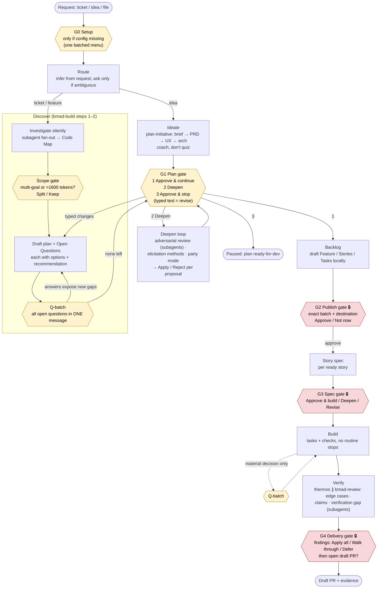

# Harness main flow: stages, gates, interaction contract

Source evidence: DAY-003 shared-lists run (test-project-template), upstream `BMAD-METHOD/skills`.

## 1. What went wrong in DAY-003, and why

| Complaint | Root cause in the harness |
|---|---|
| Inconsistent UI (buttons vs text) | Three transports (blocking tool → async buttons → chat) chosen at runtime. Any time the agent explained something or the user asked a question, the next prompt fell back to chat. |
| "Reply with the exact option wording" | Every question, even routing and product choices, goes through the decision ledger and the hook must string-match the reply. "feature", "the first", "1" failed. |
| Deeper review not offered formally | Elicitation lives in a prose note before the G1 menu (copied from BMAD), not as a menu option. |
| Felt shallow | Our vendored `bmad-build` removed what gives BMAD its depth: subagent investigation ("investigate in the current session"), `review-prompts/` (edge-case-hunter, verification-gap), `references/` (claims/deletion checks), steps 3–5. The scope gate never fired, although the plan was clearly multi-goal (auth + invitations + Android + native Linux sync engine). |
| Had to ask "what's next" | A turn could end with neither a menu nor continued work. Conflict policy was answered in conversation, never captured, and the flow stalled. |
| Not cohesive | ~8 product questions asked one at a time with a button round-trip each, plus ~3000 lines of hook/adapter code for question capture. The storyboard describes transports, not the user's journey. |

## 2. How BMAD handles UI

BMAD has **no UI tool layer**. The chat itself is the interface:

- Every pause is written as **"HALT and give the user a choice:"**, followed by bold-named options with their consequences, and then the turn ends.
- Replies are interpreted by the model: *"Accept a number, menu `code`, or fuzzy description match."* Free text counts as direction, not an error.
- Open questions are **batched**: step-02 investigates first without asking anything, writes every gap as an Open Question with options, then presents all of them in one message.
- There are only a few gates: scope split, open questions, Checkpoint 1, and review findings. Step-02 also says: *"No intermediate approvals."*
- Product shaping uses a coach stance (`bmad-architecture`): explain the alternatives and recommend one. A crisp either/or is reserved for genuinely binary forks.

## 3. Decisions: one gate model, buttons first, graceful fallback

Decided 2026-10-06: keep native buttons and make them reliable. Record every approval once, never ask for it again, and close each series of decisions with a single final acknowledgement.

1. **One gate model, several renderings.** Standard questions live in a catalog (`config/gates.toml`, ADR-0011) with ready English and Brazilian Portuguese text; the agent asks `harness decision present --gate <id>` and the harness picks the project's language. One-off questions pass their own text. Either way the content is stored with the pending decision. Each transport renders that same content:
   1. a blocking native control;
   2. an asynchronous native control;
   3. a chat menu block.

   When one transport fails, the harness moves to the next one silently and re-asks the same gate. The user never sees transport errors and is never asked to diagnose them.
2. **The chat menu block** is the last fallback, and it is also what every host shows when the agent is mid-conversation:

   ```markdown
   **G1 · Plan ready — how do you want to proceed?**

   1. **Approve and continue** — plan locks; I draft work items next.
   2. **Deepen (Recommended)** — adversarial review, elicitation, or party mode before approving.
   3. **Approve and stop** — plan locks; pause here.

   Reply with a number, an option name, or tell me what you'd like instead.
   ```

3. **Replies are matched loosely on every transport.** A reply resolves the open gate when it is:
   - a button click;
   - a number;
   - an option name (case-insensitive);
   - a unique prefix or an unambiguous paraphrase ("the first", "feature").

   A loose reply never selects an approving option unless it says "approve" itself. An ambiguous reply, a question, or other conversation leaves the gate pending: the agent answers, then shows the same menu again. On gates that allow free text (routing, the plan checkpoint), other text comes back as the human's direction, so "Revise" needs no option of its own. Native controls allow at most three options.
4. **Every answer is recorded once and not asked again.** A human-owned history keys each answer by question, options and artifact digests. Asking again about the same unchanged content returns `already_answered`. A decline is never reused. Decided 2026-10-07: **once approved, it stays approved, tied to its context.** A gate's approval is bound to what was reviewed (drafts or spec by digest, one item, one branch, one pull request), has no expiry, and ends only when revoked, when its work session ends, or when that context changes. Then the agent informs the user and asks again. General permissions (tied to nothing) keep a short window (ADR-0003 amended).
5. **Final acknowledgement at the end of a series.** Individual product choices inside a Q-batch are answers, not approvals. When the series ends, a **recap gate** lists every choice made, with the option to change any of them, and the user acknowledges once. G1 is that recap for discovery; G2–G4 are recaps for publishing, the spec and delivery.
6. **No-stall rule:** every turn ends with either a gate block or ongoing work. A status beat ends with `Next: <action>` and continues without waiting.

## 4. Main flow

Yellow = gate (turn ends; answers go into the plan). Red 🔒 = recap/approval gate (recorded once, reused until the content changes). G1 is also a recorded recap.



<details><summary>Mermaid source (regenerate the SVG with <code>npx @mermaid-js/mermaid-cli -i flow.mmd -o docs/assets/diagrams/harness-main-flow.svg</code>, <code>htmlLabels: false</code>)</summary>



</details>

### Interaction types (the only four)

| Type | When | Ends turn? | Recorded |
|---|---|---|---|
| **Gate** | G0, scope | yes | plan frontmatter / checkpoint |
| **Q-batch** | Open Questions after investigation, or a material build decision | yes | answers → frozen block |
| **Recap / approval gate** 🔒 | G1, G2, G3, G4 | yes | decision ledger (gate + digest), never re-asked |
| **Status beat** | progress between gates | **no**, ends with `Next: …` | checkpoint |

### DAY-003 replayed under this flow

Silent investigation, then a scope gate (split the native Linux sync engine into its own goal?), then **one** Q-batch with 6 questions and a recommendation for each, then G1 with **Deepen** as option 2. Deepen loops (First principles → Assumption audit → Security personas) return to G1 automatically. That is about 4 user turns before approval, compared with roughly 20 in the original run.

## 5. Direction (priority order)

### P1: Restore BMAD depth (top priority) — implemented on `feat/bmad-depth`, awaiting P4 replay

Our vendored skills consistently turned off the three things that make BMAD deep: subagents, the memlog, and the reviewers.

| Status | Gap | Fix |
|---|---|---|
| ✅ | Investigation ran in one session | `bmad-build` step-02 restores the upstream subagent fan-out; `workflow.md` asks once per run when the host needs permission. |
| ✅ | Missing upstream skills | `bmad-correct-course`, `bmad-project-context`, `bmad-deep-recon`, `bmad-qa-generate-e2e-tests` vendored (pristine copy under `vendor/bmad/upstream/`) and wired in. |
| ✅ | Scope gate never fired | Multi-goal and token checks run again on the decided plan; compressing the plan to fit is forbidden. |
| ✅ | Party mode was one voice | Upstream `auto`/`subagent`/`agent-team` modes restored, default `auto`; per-party memory restored. |
| ✅ | No durable decision memory | `plan-<slug>.memlog.md` beside the plan (new `memlog_command` in the render context); every answer, accepted proposal, scope choice and approval is logged; resume reads it first. |
| ✅ | Deepen not a formal option | Checkpoint 1 is now a menu: *Approve and continue / Deepen / Approve and stop*, with typed changes as revisions. Deepen = `bmad-review` (adversarial + edge-case lenses, parallel subagents) → elicitation → party mode offer. The recap lists every recorded decision instead of re-asking. |
| ✅ | Build and verify were thin | Verify runs `thermos` ∥ `bmad-review` edge-case (claims + deletion checks) and verification-gap lenses, then one triage menu. Build generates e2e tests at Story done. BMAD's code-diff `review-prompts/` stay unvendored: `bmad-review` ships the same lenses. |
| ✅ | Quiz instead of coaching | Open Questions go out in one message with trade-offs and a recommendation; answers accepted in any form. |
| ✅ | Subagents also disabled elsewhere | `bmad-prd` (research, extraction, review lenses, reconciliation) and `bmad-review` (parallel lenses) restored. |

### Standing duty: documentation

Every change in P1–P4 updates, in the same branch:

- [x] `docs/02-design/workflows.md` — discovery depth model, correct-course, Build/Verify changes (P1).
- [x] `vendor/bmad/SOURCE-MANIFEST.md` — bundled skills and each harness adaptation (P1).
- [x] `CHANGELOG.md` and `docs/06-delivery/changelog.md` (P1).
- [x] `references/human-decisions.md` and `references/workflow-storyboard.md` — rewritten for menus and question batches (P2).
- [x] `docs/03-engineering/discovery-rendering.md` — memlog command (P2).
- [x] `docs/02-design/workflows.md` "Asking the human", ADR-0003 amendment, both changelogs (P2).
- [ ] This spec — status per phase, and the diagram regenerated when the flow changes (`docs/assets/diagrams/harness-main-flow.svg`).
- [ ] User-facing guide (`docs/07-guides/`) — what each gate means and how to answer it (after P4).

### P2: Gate model and reliable buttons — implemented on `feat/gate-model`, awaiting P4 replay

| Status | Item | Result |
|---|---|---|
| ✅ | Loose reply matching on every transport | `questions.match_option`: number, ordinal (en/pt-br), label in any case or accents, `&` = and, unique prefix, unique word set. Never selects an approving option unless the reply says "approve". Typed replies now count after a dismissed picker or expired buttons. |
| ✅ | One rendering | `decision present --detail --recommended`; options and details are stored with the decision, so every fallback returns the same numbered `menu` (en/pt-br). |
| ✅ | Answer once | `decision-history.json` (human-owned); `already_answered` for unchanged content or target. |
| ✅ | Approvals tied to context | Gate approvals bind drafts/spec digests or an item, branch, or pull request; no expiry; end on revoke, session stop, or context change, with a "what changed" refusal. Write targets are read from each call (`rules.write_targets`). |
| ✅ | Contract rewrite | `human-decisions.md` (menus vs. question batches, never stall), storyboard, harness skill, plan checkpoint as a three-option menu. |
| ✅ | Gate catalog | `config/gates.toml` with 11 gates in en and pt-BR; `decision present --gate --value`; approvals only through gates; catalog tests for completeness, slots and plain wording (ADR-0011). Exceptions still asked natively by their skills: manual-check, adoption, and tracker-trust questions, whose hook pins require a native control. |
| ⏳ | Per-host live reliability (click, number, name, paraphrase on Codex, Claude Code, Cursor) | Covered by hook-level tests; live hosts are part of the P4 replay. |

### P3: Flow continuity

1. A no-stall `Stop` hook: if a workflow is active and the last message has neither a gate nor a `Next:` line, nudge the agent to continue.
2. Scope pending decisions to the work session (a known gap noted in the storyboard).

### P4: Acceptance

Replay DAY-003 on test-project-template in Codex and Claude Code, and keep the replay as a regression fixture. Pass criteria:

- the scope split is offered;
- one Q-batch with recommendations;
- Deepen is option 2 at G1 and runs reviewer subagents;
- the memlog holds every decision, and resume reads it;
- party mode spawns per-persona agents on a host that supports them;
- zero "reply with exact wording", zero "what's next", zero repeated approvals;
- buttons on both hosts, with chat fallback verified.

## 6. Decisions

- ✅ Keep native buttons; make them reliable; fall back silently to the next transport.
- ✅ Record every approval once; no repeated approvals; a final recap acknowledgement at the end of each decision series.
- ✅ Once approved, approved: approvals are tied to their context and do not expire; general permissions stay short (2026-10-07).
- ✅ Standard questions in a catalog with ready en/pt-BR text; the agent only picks the gate (2026-10-07).
- ✅ BMAD depth is priority one.
- ✅ Add upstream skills, vendored with subagents and memlog intact:
  - `bmad-correct-course` — change of direction mid-feature; re-enters at the earliest affected gate.
  - `bmad-project-context` — persistent facts loaded at Discover. In DAY-003, `current-state.md` claimed a working sign-out that the code did not have; that kind of drift is what this skill catches.
  - `bmad-deep-recon` — available in Discover and Deepen for unfamiliar code or domains.
  - `bmad-qa-generate-e2e-tests` — runs in Build/Verify alongside `automated-tests`.
- ✅ Code review stays with `thermos`. Verify runs `thermos` plus `bmad-review`'s edge-case (claims + deletion) and verification-gap lenses. Of BMAD's step-04/05 we port only the findings-triage menu.
- ✅ Documentation is a standing duty of every phase (see §5).
